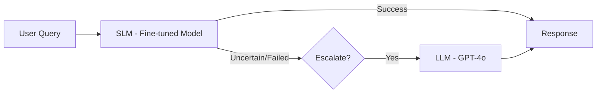

# Model Gateway: SLM + LLM Merge Guide

A guide to merge your **fine-tuned SLM** (primary model) with the existing **LLM** (escalation model) using an intelligent **Model Gateway Router**.

---

## 📋 Overview

### Your Architecture
Since your teammate's SLM is **fine-tuned for TalentOps operations**, the routing is:

| Model | Role | Handles |
|-------|------|---------|
| **SLM** | Primary | Task creation, timesheets, data fetching, all functional HR operations |
| **LLM** | Escalation | Complex reasoning, ambiguous queries, edge cases SLM can't handle |



---

## 🔧 Current LLM Architecture

Your existing chatbot backend located at:
```
T-ops/Talent Ops/chatbot-backend/
├── main.py           # Flask API endpoint (/chat)
├── llm_service.py    # OpenAI GPT-4o-mini integration
├── sql_agent.py      # SQL generation using LLM
├── guardrails.py     # Security & validation
├── role_engine.py    # RBAC permission checks
├── supabase_client.py
└── server.py
```

### How LLM is Used Now
The `sql_agent.py` calls `llm_service.call_llm()` to:
1. Classify user intents
2. Generate SQL queries
3. Create action payloads (assign_task, apply_leave, etc.)

---

## ✅ Steps to Merge SLM with LLM

### Step 1: Add SLM Service File

When you merge your teammate's SLM folder, ensure you have an SLM service file similar to this structure:

**Create**: `chatbot-backend/slm_service.py`

```python
# slm_service.py - Small Language Model Service
import os
import requests
from dotenv import load_dotenv

load_dotenv()

# SLM Configuration (adjust based on your teammate's model)
SLM_ENDPOINT = os.getenv("SLM_ENDPOINT", "http://localhost:11434/api/generate")  # Ollama
SLM_MODEL = os.getenv("SLM_MODEL", "your-fine-tuned-model")  # Your teammate's model

def call_slm(prompt: str) -> str:
    """
    Sends a prompt to the local SLM and returns the response.
    Adjust this based on how your teammate's model is hosted.
    """
    try:
        response = requests.post(
            SLM_ENDPOINT,
            json={
                "model": SLM_MODEL,
                "prompt": prompt,
                "stream": False
            },
            timeout=30
        )
        response.raise_for_status()
        data = response.json()
        return data.get("response", "").strip()
    except Exception as e:
        print(f"[SLM] Error: {e}")
        return None  # Return None to trigger LLM fallback
```

---

### Step 2: Create the Model Gateway Router

**Create**: `chatbot-backend/model_gateway.py`

```python
# model_gateway.py - SLM-First Gateway with LLM Escalation

from llm_service import call_llm
from slm_service import call_slm

# ============ ESCALATION DETECTION ============

# Phrases that indicate SLM needs help (trigger LLM escalation)
ESCALATION_TRIGGERS = [
    "i don't know",
    "i'm not sure", 
    "cannot help",
    "unable to",
    "i don't understand",
    "please clarify",
    "error",
    "not trained",
    "out of scope",
    "need more context",
]

# Query patterns that should ALWAYS go to LLM (bypass SLM)
LLM_ONLY_PATTERNS = [
    # Complex multi-step reasoning
    "compare", "analyze", "summarize",
    "what if", "should i", "recommend",
    # Ambiguous natural language
    "help me decide", "what do you think",
    # Edge cases and clarifications
    "explain why", "how does this work",
]


def needs_escalation(response: str) -> bool:
    """
    Check if SLM response indicates it needs LLM help.
    """
    if not response or len(response.strip()) < 5:
        return True
    
    response_lower = response.lower()
    return any(trigger in response_lower for trigger in ESCALATION_TRIGGERS)


def should_bypass_slm(query: str) -> bool:
    """
    Check if query should go directly to LLM (skip SLM).
    """
    query_lower = query.lower()
    return any(pattern in query_lower for pattern in LLM_ONLY_PATTERNS)


def route_query(prompt: str, role: str = None, user_id: str = None) -> str:
    """
    Main Gateway: SLM-first with automatic LLM escalation.
    
    Flow:
    1. Check if query needs LLM directly
    2. Try SLM first (it handles most operations)
    3. If SLM fails/uncertain → escalate to LLM
    """
    
    # Step 1: Check for LLM-only queries
    if should_bypass_slm(prompt):
        print(f"[GATEWAY] Query requires LLM → routing directly")
        return call_llm(prompt)
    
    # Step 2: Try SLM first (your teammate's fine-tuned model)
    print(f"[GATEWAY] Trying SLM first...")
    slm_response = call_slm(prompt)
    
    # Step 3: Check if escalation needed
    if needs_escalation(slm_response):
        print(f"[GATEWAY] SLM uncertain → escalating to LLM")
        return call_llm(prompt)
    
    print(f"[GATEWAY] SLM handled successfully")
    return slm_response


# ============ OPTIONAL: CONFIDENCE-BASED ROUTING ============
# If your SLM returns confidence scores, use this instead

def route_with_confidence(prompt: str, confidence_threshold: float = 0.7) -> str:
    """
    Alternative routing using SLM confidence scores.
    Use this if your teammate's SLM returns confidence values.
    """
    response, confidence = call_slm_with_confidence(prompt)  # Adjust to your SLM's API
    
    if confidence >= confidence_threshold:
        return response
    else:
        print(f"[GATEWAY] SLM confidence {confidence:.2f} < {confidence_threshold} → LLM")
        return call_llm(prompt)
```

---

### Step 3: Integrate Gateway into sql_agent.py

Modify your existing `sql_agent.py` to use the gateway:

```python
# sql_agent.py - Updated to use Model Gateway

from model_gateway import route_query, classify_complexity
from llm_service import call_llm  # Keep for direct LLM calls when needed

def generate_sql(role: str, user_id: str, team_id: str, user_message: str) -> str:
    """
    Generate SQL or action JSON using the Model Gateway.
    """
    complexity = classify_complexity(user_message)
    
    # For write operations, ALWAYS use LLM (critical path)
    if _is_write_operation(user_message):
        return call_llm(_build_full_prompt(role, user_id, team_id, user_message))
    
    # Use gateway for read operations
    return route_query(_build_full_prompt(role, user_id, team_id, user_message), role, user_id)


def _is_write_operation(message: str) -> bool:
    """Critical operations should always use LLM."""
    write_keywords = ['create', 'assign', 'add', 'submit', 'apply', 
                      'approve', 'reject', 'update', 'delete', 'remove']
    text = message.lower()
    return any(kw in text for kw in write_keywords)
```

---

### Step 4: Update Environment Variables

Add these to your `.env` file:

```env
# Existing LLM Config
OPENAI_API_KEY=sk-xxxx
LLM_MODEL=gpt-4o-mini

# New SLM Config (adjust based on your teammate's setup)
SLM_ENDPOINT=http://localhost:11434/api/generate
SLM_MODEL=talent-ops-slm
SLM_ENABLED=true
```

---

## 📁 Folder Structure After Merge

```
chatbot-backend/
├── main.py                 # Flask API (unchanged)
├── model_gateway.py        # NEW: Intelligent router
├── llm_service.py          # Existing: OpenAI integration
├── slm_service.py          # NEW: Your teammate's SLM integration
├── sql_agent.py            # MODIFIED: Uses gateway
├── guardrails.py           # Unchanged
├── role_engine.py          # Unchanged
├── supabase_client.py      # Unchanged
├── server.py               # Unchanged
└── requirements.txt        # ADD: any SLM dependencies
```

---

## 🔄 SLM vs LLM Task Distribution

| Task Type | Model | Why |
|-----------|-------|-----|
| Task Creation | **SLM** | Fine-tuned for this |
| Timesheet Operations | **SLM** | Fine-tuned for this |
| Data Fetching | **SLM** | Fine-tuned for this |
| Leave Requests | **SLM** | Fine-tuned for this |
| Status Checks | **SLM** | Fine-tuned for this |
| Greetings | **SLM** | Simple pattern |
| **Complex Comparisons** | LLM | Multi-step reasoning |
| **Ambiguous Queries** | LLM | Needs clarification |
| **"What if" Scenarios** | LLM | Hypothetical reasoning |
| **SLM Failures** | LLM | Automatic escalation |

---

## ⚠️ Important Merge Checklist

> [!IMPORTANT]
> Before merging, verify these items:

- [ ] Your teammate's SLM model is compatible with REST API calls
- [ ] SLM endpoint is accessible (local or remote)
- [ ] SLM response format matches expected structure
- [ ] No conflicting file names between projects
- [ ] `requirements.txt` includes all SLM dependencies

---

## 🚀 Testing the Gateway

After merging, test with these queries:

```bash
# Should route to SLM
curl -X POST http://localhost:5000/chat \
  -H "Content-Type: application/json" \
  -d '{"message": "hello", "role": "employee", "user_id": "test"}'

# Should route to LLM  
curl -X POST http://localhost:5000/chat \
  -H "Content-Type: application/json" \
  -d '{"message": "create a task for John due tomorrow", "role": "manager", "user_id": "test"}'
```

Check logs for `[GATEWAY]` messages to verify routing.

---

## 📌 Next Steps

1. **Share this guide** with your teammate
2. **Merge their SLM folder** into `chatbot-backend/`
3. **Adjust `slm_service.py`** to match their model's API
4. **Test routing** with sample queries
5. **Fine-tune patterns** in `model_gateway.py` based on real usage

---

## Questions?

If you merge the folders and share the updated structure, I can help you:
- Integrate the actual SLM service file
- Update the gateway patterns
- Fix any merge conflicts
- Test the complete flow
